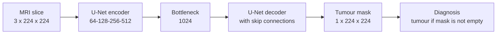

# Brain Tumor Semantic Segmentation with U-Net

A PyTorch implementation of U-Net that segments tumours in brain MRI slices from the **LGG MRI Segmentation** dataset. The same model also decides whether a slice contains a tumour: a slice is called tumour when its predicted mask is not empty.



## Results

> Approximate values from the original notebook (`notebooks/`). They were not reproduced by running this repository.

| Task | Metric (test set, 767 slices) | Value |
|---|---|---|
| Segmentation (tumour slices) | Dice score | ~0.82 |
| | IoU (Jaccard index) | ~0.73 |
| Diagnosis (tumour vs normal) | F1-score | ~0.96 |
| | Matthews correlation coefficient | ~0.93 |
| | Error rate | ~3% (~23 slices) |

The validation Dice on tumour slices was about 0.90. See [`results/reported_results.json`](results/reported_results.json).

## Repository structure

```
brain-tumor-segmentation/
├── train.py                  # train the U-Net
├── evaluate.py               # test-set segmentation + diagnosis metrics, figures
├── configs/default.yaml      # all settings (image size, split, optimiser, thresholds)
├── unet_seg/
│   ├── data.py               # dataset indexing, split, augmentation, Dataset class
│   ├── model.py              # U-Net (DoubleConvBlock, encoder / bottleneck / decoder)
│   ├── engine.py             # training / validation / test loops, checkpointing
│   ├── metrics.py            # accuracy, precision, recall, Dice, IoU, MCC
│   ├── plotting.py           # training curves, confusion matrix, prediction overlays
│   └── config.py             # YAML config + command-line overrides
├── scripts/prepare_splits.py # build train / val / test CSV files
├── notebooks/                # the original exploratory notebook
├── data/README.md            # where to download the dataset and how to place it
├── results/                  # results reported in the notebook
└── tests/                    # quick unit tests (no data needed)
```

## Installation

```bash
git clone https://github.com/aliasgher1996/Brain-Tumor-Semantic-Segmentation-.git
cd Brain-Tumor-Semantic-Segmentation-
pip install -r requirements.txt
pytest tests/
```

## Dataset

Download the [LGG MRI Segmentation dataset](https://www.kaggle.com/datasets/mateuszbuda/lgg-mri-segmentation) and put the `kaggle_3m` folder in `data/`. Details are in [`data/README.md`](data/README.md).

## Usage

```bash
# 1. index the dataset and create the 70 / 10.5 / 19.5 % stratified split
python scripts/prepare_splits.py

# 2. train
python train.py

# 3. evaluate on the test set
python evaluate.py
```

- `train.py` writes checkpoints, `history.csv` and `training_curves.png` to `runs/unet/`.
- `evaluate.py` writes metrics tables, a confusion matrix and prediction overlays to `runs/unet/evaluation/`.

Any setting can be changed from the command line, for example:

```bash
python train.py --opts train.epochs=50 train.batch_size=16 data.root=/path/to/kaggle_3m
```

## Method

| Setting | Value |
|---|---|
| Input | 3-channel MRI slice scaled to [0, 1], resized to 224 × 224 |
| Augmentation (train only) | Random brightness/contrast (p = 0.2), horizontal flip (0.5), vertical flip (0.5) |
| Model | U-Net: two 3×3 conv + BatchNorm + ReLU per block, widths 64-128-256-512, bottleneck 1024, transposed-conv upsampling, 1×1 output conv |
| Loss | Binary cross-entropy with logits |
| Optimiser | AdamW, learning rate 1e-4 |
| LR schedule | ReduceLROnPlateau on validation loss, patience 8 |
| Training | 100 epochs, batch size 32 (× number of GPUs) |
| Mask threshold | 0.5 (0.3 used for the segmentation metrics, as in the notebook) |
| Diagnosis | Tumour if the predicted mask has any positive pixel |

### Notes

- **Empty masks and metrics:** segmentation metrics are averaged per image. On slices with no tumour, where both masks are empty, Dice and IoU come out as 0. For this reason, results are reported separately for tumour and normal slices.
- **Split per slice:** the default split, like the notebook's, is made per slice, so one patient can appear in both train and test. Use `--opts data.split_by_patient=true` to evaluate on unseen patients.

## Dataset citation

> Buda M., Saha A., Mazurowski M.A. (2019). Association of genomic subtypes of lower-grade gliomas with shape features automatically extracted by a deep learning algorithm. *Computers in Biology and Medicine* 109:218–225.

U-Net: Ronneberger O., Fischer P., Brox T. (2015). U-Net: Convolutional Networks for Biomedical Image Segmentation. *MICCAI*.
